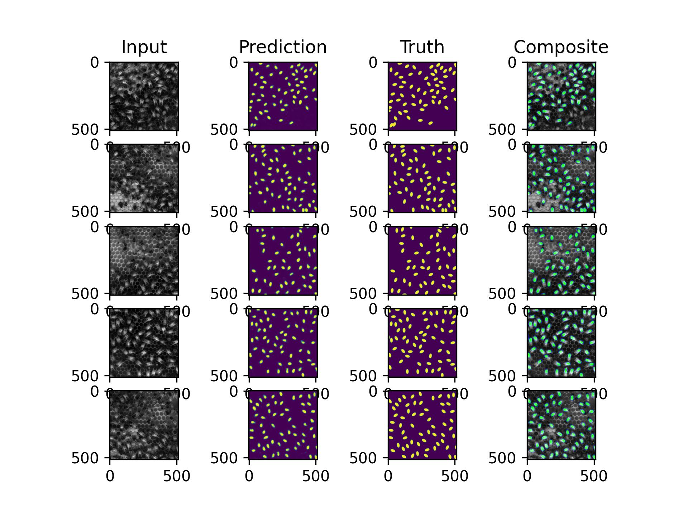
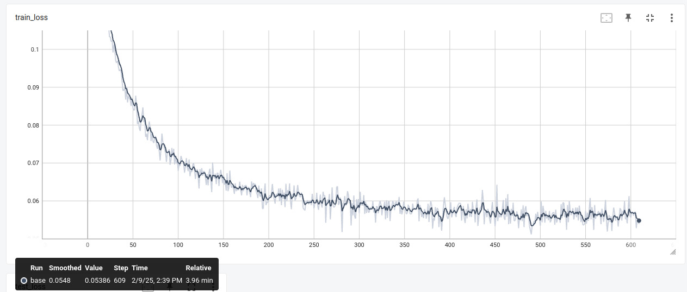
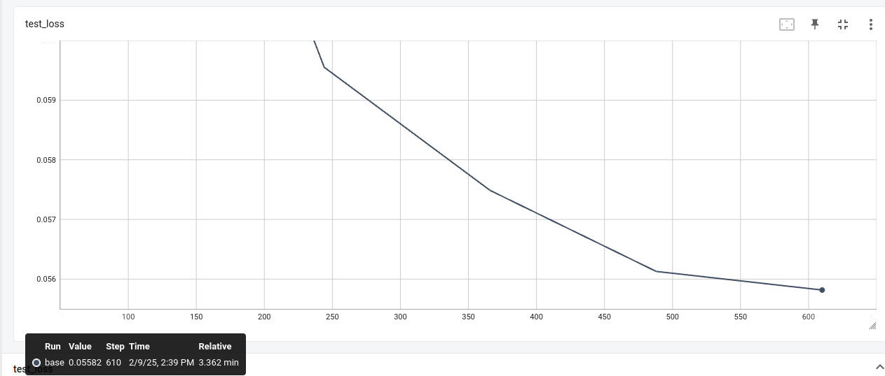
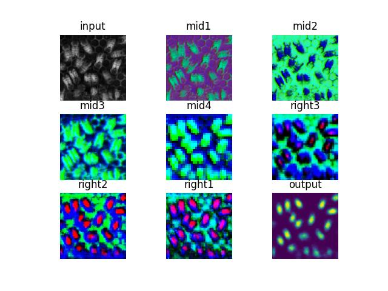

# Reduced U-Net results at Feb 8, 2025

Implemented and trained Reduced U-Net from the 2017 bee tracking paper:
https://arxiv.org/pdf/1712.08324

In this report, we evaluate the performance on the problem of detecting a dense collection of bees.

## Model

The model is a Reduced U-Net, as described in the paper. See `model.py` for implementation details.

The Base model in this experiment uses multiples of 16 channels, 2 convs per block, and 2x pooling/upsampling.
There are three blocks in the encoder and decoder, and a final 1x1 conv as the head.
Including the top and bottom, the U-Net is 4 levels deep (i.e. 3 poolings/upsamplings).

Base image resolution is 256x256.

## Experiments

Training hyperparameters:

- 5 epochs, 122 steps each, batch size 64.
- LR: 1e-3

Experiments:

- Base: Base model (see above).
- Double channels: Double base number of channels to 32.

| Model | Params | Val loss |
| --- | --- | --- |
| Base | 0.5M | 0.55 |
| Double channels | 1.9M | 0.55 |

## Results

## Hidden layer visualization

Model: U-Net with residual connections, 16 base channels, 5 epochs. Final loss 0.047.

We visualize the model with PCA on the hidden layers.

## Fixing the vanishing gradient problem

In a previous experiment, models tended to fail, producing output images that are completely black.
This is most likely due to random chance, as models occasionally perform well.
This was fixed with `BatchNorm2d`. Almost all runs converge quickly now.
